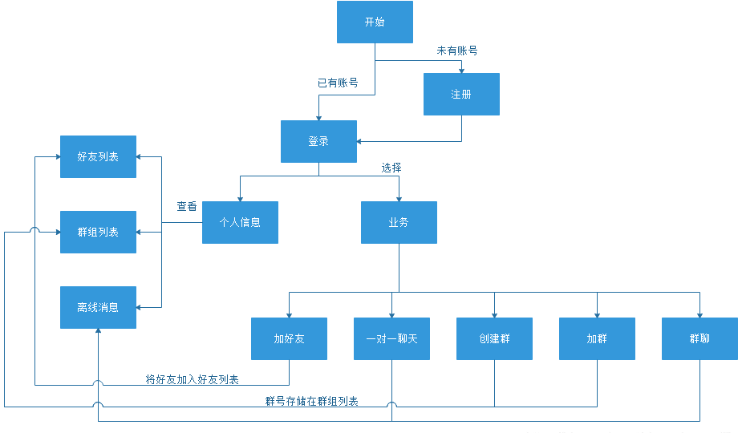

# chatserver
## 项目描述
一个基于muduo网络库的聊天服务器+聊天客户端项目，服务器端使用了redis缓存集群和Nginx/Tcp集群方案。其中，nginx负责处理客户端的请求，通过nginx的负载均衡策略，nginx会筛选出压力最小的服务器，用于处理客户端的请求信息。信息到达服务器后，再进入作为缓存队列的redis中，然后通过发布-订阅模式，转发到客户端正在进行通信的另一方客户端。客户端用户注册的账号信息会保存到MySQL数据库中。
## 项目依赖
平台工具：VScode远程连接Ubuntu20.04开发。  
muduo网络库  
数据库：mysql  Ver 8.0.33-0ubuntu0.20.04.2 for Linux on x86_64 ((Ubuntu))  
缓存服务器：redis version:5.0.7  
反向代理服务器：nginx version:1.18.0
## 业务流程
  